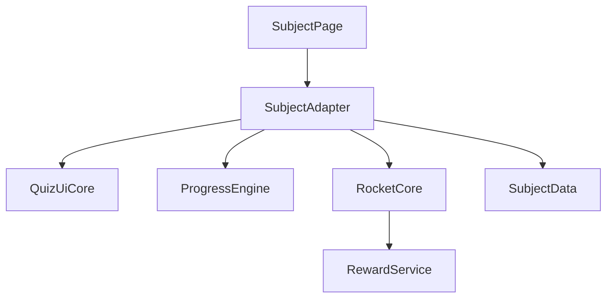

# 공용 로직 분리 조사 결과 (2026-03-27)

## 1) `rocket.js` 동일/차이 분류

대상 파일:
- `english/rocket.js`
- `korean/rocket.js`
- `math/rocket.js`
- `science/rocket.js`

판정:
- **완전 동일 복제**

근거:
- 함수 세트가 4개 파일에서 동일하게 존재함.
  - `updateStreak`, `updateRocketUI`, `launchRocket`, `crashRocket`
  - `netBounceRocket`, `showNetBanner`, `showNetActivatedBanner`, `showNetIndicator`
  - `flashScreen`, `flashScreenRed`, `spawnExhaust`, `spawnExplosion`, `spawnSmoke`, `spawnImpactDust`
  - `initRocketPanel`
- 전역 보상 호출도 동일함.
  - `RewardSystem.playEntranceAndOpenRoulette('rp-rocket')`

결론:
- `rocket` 영역은 즉시 `common/rocket-core.js`로 추출 가능한 1순위 공용화 대상.

---

## 2) `engine.js` 공통 알고리즘 vs 과목 데이터 경계

### 공통 알고리즘 코어 (공용화 가능)
- 통계 수명주기:
  - `emptyStats`, `loadStats`, `saveStats`, `resetStats`
- 난이도 계산:
  - `getBaseDiffLevel`, `getDifficultyLevel`
- 출제 강화:
  - `generateQuestion`, `_generateCandidate`, `recordResult`, `showWeaknessClear`
- 공통 상태:
  - `recentHistory`, `wrongPatterns`, `recentQuestions`
  - `globalBoost`, `NET_STREAK`, `hasNet`, `netStreak`

### 과목 데이터/규칙 어댑터 (도메인 전용)
- 영어/국어/과학:
  - 카테고리 기반 (`pickCategory`)
  - 단어/문장 DB 기반 보기 생성
- 수학:
  - 연산자 기반 (`pickOperation`)
  - 수식 생성(`generateByOpLevel`)과 숫자 보기 생성

### 권장 경계
- 공통 코어:
  - `createProgressEngine(config)`
- 과목 어댑터:
  - `selectDomain()`, `buildQuestionByLevel()`, `buildChoices()`, `toWeaknessKey()`

결론:
- 알고리즘은 공통화하고, 과목별 규칙/DB 접근만 어댑터로 남기는 방식이 가장 안전함.

---

## 3) `ui.js` 공통 게임 수명주기 통합안

공통 수명주기:
1. `startGame`
2. `askQuestion`
3. `startTimer` / `updateTimerUI` / `timeOut`
4. `checkAnswer`
5. `nextQuestion`
6. `showResult`
7. `openStats` / `renderStatsTable`

공통화 가능 영역:
- 타이머 로직 (`startTimer`, `stopTimer`, `updateTimerUI`, `timeOut`)
- 정답 처리 골격 (`checkAnswer`)
- 진행/결과 전환 (`nextQuestion`, `showResult`, `startGame`)
- 통계 모달 껍데기 (`openStats`, `closeStats`, `onModalBackdrop`)
- 축하 효과 (`spawnConfetti`)

과목별 예외:
- 영어:
  - 순차 빈칸 로직 (`checkSeqAnswer`, `renderSeqWord`)
- 수학:
  - 숫자 비교를 위한 `parseInt` 처리
  - 정오답 사운드 (`playCorrect`, `playWrong`, `playTimeout`)
- 국어/과학:
  - 카테고리 라벨/피드백 문구 차이

결론:
- `quiz-ui-core` + 과목별 `ui-adapter` 2계층으로 분리하면 중복과 예외를 동시에 관리 가능함.

---

## 4) 공용 모듈 구조 및 의존성 방향 (SDD)

제안 디렉터리:
- `common/rocket-core.js`
- `common/progress-engine.js`
- `common/quiz-ui-core.js`
- `common/audio.js`
- `common/stats-modal.js`

의존성 규칙:
- 공용 코어는 도메인 데이터를 직접 참조하지 않음.
- 과목 어댑터가 공용 코어에 설정/함수만 주입함.
- `global/reward.js`는 인프라 서비스로 두고, `rocket-core`에서 훅 형태로 호출함.

---

## 5) 마이그레이션 우선순위 (저위험 -> 고효과)

1. `rocket-core` 추출
   - 이유: 4개 파일 완전 복제, 회귀 영향 범위 명확
2. `progress-engine` 공통화
   - 이유: 알고리즘 동일, 데이터 어댑터만 분리하면 됨
3. `quiz-ui-core` 추출
   - 이유: 중복이 크지만 영어/수학 예외 처리 필요
4. `stats-modal` 및 DOM 헬퍼 공통화
   - 이유: UI 변경 시 확산 수정 감소
5. `audio` 유틸 공통화
   - 이유: 기능 리스크 낮고 유지보수 편익 있음

회귀 체크포인트:
- 그물망(`hasNet`) 획득/소모 규칙
- 로켓 발사 시 `RewardSystem` 호출 타이밍
- 시간초과 시 정답 표시 및 `recordResult(false, TIME_LIMIT)` 일관성
- 영어 순차 빈칸 단계 진행 정확성
- 수학 숫자형 비교(`parseInt`) 안정성
