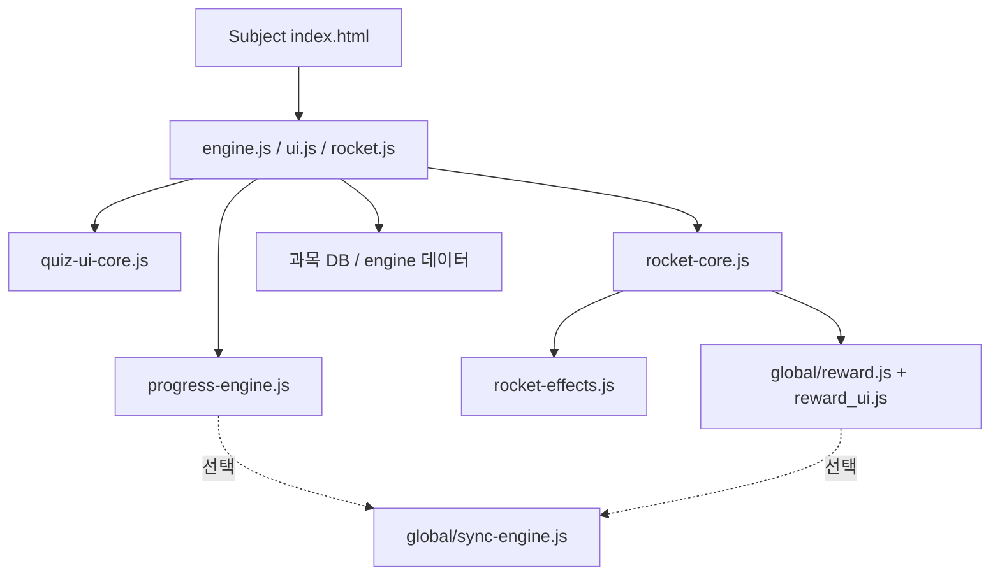

# 공용 로직 분리 조사 및 적용 현황

**최초 조사**: 2026-03-27 · **최종 정리**: 2026-03-29  

본 문서는 당시 과목별 중복을 기록한 **조사 메모**이며, 이후 리팩터가 반영된 **현재 상태**를 같은 목차로 정리한다. 상세 계약은 `docs/specs/shared_core_refactor_spec.md`, `docs/CRITICAL_LOGIC.md`를 따른다.

---

## 1) `rocket.js` — 과목별 래퍼 + 공용 코어

### 조사 시점 (2026-03-27)

- `english/korean/math/science/rocket.js`가 동일한 함수 묶음으로 **완전 복제**되어 있었음.
- 보상 훅 예시: `RewardSystem.playEntranceAndOpenRoulette('rp-rocket')` (이후 폐기됨).

### 현재 (2026-03-29)

- 과목별 `rocket.js`는 **`RocketCore.install(window)` 한 줄** 위주로 축소됨. 구현 SSOT는 `common/rocket-core.js`, 시각 이펙트는 `common/rocket-effects.js`.
- 20연속 정답 보상 훅: `RewardSystem.playEntranceAndAddGem('rp-rocket')` (`global/reward.js` → `reward_ui.js`).
- HTML 로드 순서: `rocket-effects.js` → `rocket-core.js` → 과목 `rocket.js` (프로젝트 표준 페이지와 동일하게 유지).

---

## 2) `engine.js` — `progress-engine` + 도메인 어댑터

### 조사 시점

- 통계·난이도·강화출제·`recentHistory` / `hasNet` 등이 과목 간 복제 후보였음.

### 현재

- `common/progress-engine.js`가 `emptyStats`, `loadStats`, `saveStats`, `getBaseDiffLevel`, `getDifficultyLevel` 등 공통 경로를 제공하고, 과목 `engine.js`는 연산/카테고리/문항 생성만 유지.
- 동기화: `saveStats` 경로에서 `global/sync-engine.js`가 연결된 경우 원격 병합 푸시 가능(`docs/memory.md` 참고).

---

## 3) `ui.js` — `quiz-ui-core` + 과목 예외

### 조사 시점

- 타이머·모달·정답 흐름 중복이 컸고, 영어 순차 빈칸·수학 사운드 등 예외가 있었음.

### 현재

- `common/quiz-ui-core.js`의 `createAnswerFlowCore`, 영어 순차용 `createSequentialAnswerCore` 등으로 **정답 처리 SSOT**가 정리됨(`docs/CRITICAL_LOGIC.md` §11).
- 정적 검증: `node verify_shared_core_contract.js`, `node verify_all.js`.

---

## 4) 의존성 방향 (SDD, 현행)

- 공용 코어는 도메인 데이터를 직접 들고 있지 않음.
- `common/audio.js`, `common/stats-modal.js`는 **별도 파일로는 두지 않음** — 수학 사운드 등은 과목 모듈(`math/sound.js` 등)·기존 UI에 유지.

---

## 5) 마이그레이션 결과 및 회귀 체크

| 우선순위(당시) | 결과 |
|----------------|------|
| rocket-core | 완료 + `rocket-effects` 분리 |
| progress-engine | 완료 |
| quiz-ui-core | 완료(정답 흐름·순차 종결) |
| stats-modal / audio 단일 모듈 | 미도입(필요 시 과목 단위로 유지) |

**회귀 시 반드시 확인할 항목** (변경 후):

- 그물망 `hasNet` / `netStreak` / `NET_STREAK` (`docs/CRITICAL_LOGIC.md` §7).
- 로켓 발사 시 `playEntranceAndAddGem` 호출.
- 시간 초과 시 `recordResult(false, TIME_LIMIT)` 일관성.
- 영어 순차 빈칸 종결·수학 `parseInt` 비교.
- `node verify_all.js` · `node verify_net_logic.js` · `node verify_shared_core_contract.js` PASS.
